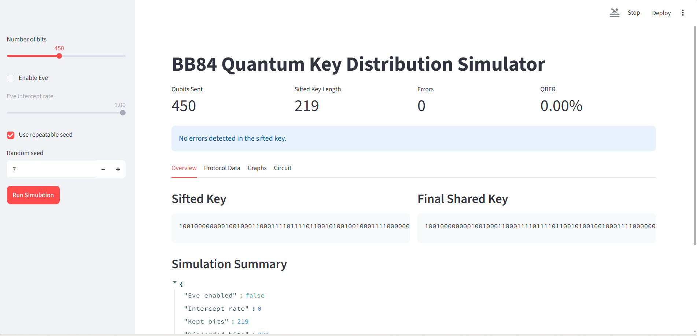
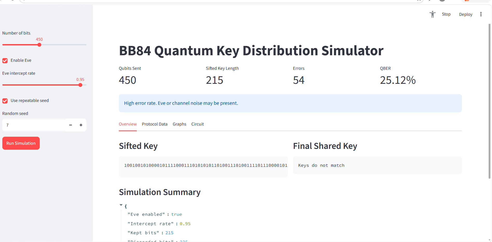

# BB84 Quantum Cryptography Simulator

This project is a modular Python simulation of the BB84 quantum key distribution protocol. It demonstrates how Alice and Bob can generate a shared key, how an intercept-resend attack by Eve affects the transmission, and how QBER helps detect possible eavesdropping or channel noise.

## Project Status

> **Software simulation: complete and working.** The BB84 protocol, the Eve intercept-resend attack, QBER-based eavesdropping detection, the command-line tool, the Streamlit dashboard, and the automated test suite are all implemented and passing.
>
> **Research: ongoing.** This is an active project. Work continues on the research and analysis side — deeper study of the protocol, noise modelling, additional attack strategies, and extensions such as error correction and privacy amplification (see *Future Enhancements* below). Expect this repository to keep evolving.

## Demo

The dashboard makes BB84's core security property visible. With no eavesdropper, Alice and Bob's sifted keys match perfectly (QBER 0%). Enable Eve, and her intercept-resend attack drives the error rate to ~25% — the tell-tale fingerprint that the channel is being watched, which is exactly how BB84 detects eavesdropping.

**Honest channel — no eavesdropper (QBER 0.00%, keys match)**



**Eavesdropper present — Eve enabled (QBER 25.12%, keys do not match)**



## Features

- BB84 protocol simulation with Alice, Bob, and optional Eve.
- Random bit and basis generation.
- Qubit encoding and measurement logic.
- Key sifting based on matching bases.
- QBER calculation with a configurable security threshold.
- Structured logging for major protocol steps.
- Streamlit GUI with protocol data, charts, and circuit visualization.
- Unit tests for the core protocol functions.

## Folder Structure

```text
Mini Project/
├── alice.py              # Alice bit, basis, and signal preparation
├── app.py                # Streamlit user interface
├── bob.py                # Bob basis selection and measurement
├── config.py             # Project configuration values
├── eve.py                # Eve intercept-resend attack
├── main.py               # Command-line entry point
├── qber.py               # QBER calculation and security status
├── utils.py              # Shared data structures and helpers
├── visualization.py      # Tables and Matplotlib charts
├── assets/               # Placeholder for screenshots and media
├── report/               # Report-related files
└── tests/                # Unit tests
```

## Installation

Create and activate a virtual environment, then install the required packages.

```powershell
python -m venv venv
.\venv\Scripts\activate
pip install qiskit streamlit matplotlib pandas
```

If the provided `venv` folder already exists, activate it directly:

```powershell
.\venv\Scripts\activate
```

## Running The Project

PowerShell:

```powershell
python main.py
```

With Eve enabled:

```powershell
python main.py --qubits 64 --eve --seed 7
```

cmd:

```cmd
python main.py
```

## Running The Streamlit App

PowerShell:

```powershell
.\venv\Scripts\streamlit.exe run app.py
```

cmd:

```cmd
venv\Scripts\streamlit.exe run app.py
```

## Running Tests

```powershell
python -m unittest discover
```

## Screenshots

Add screenshots to the `assets/` folder.

```text
assets/dashboard.png
assets/qber_graph.png
assets/transmission_log.png
```

## Technologies Used

- Python
- Qiskit
- Streamlit
- Matplotlib
- Pandas
- unittest

## Future Enhancements

- Privacy amplification after key sifting.
- Error correction for low-noise channels.
- Multiple eavesdropping strategies.
- Configurable quantum channel noise.
- Real IBM Quantum backend support.
- Additional QKD protocols such as B92 and E91.
